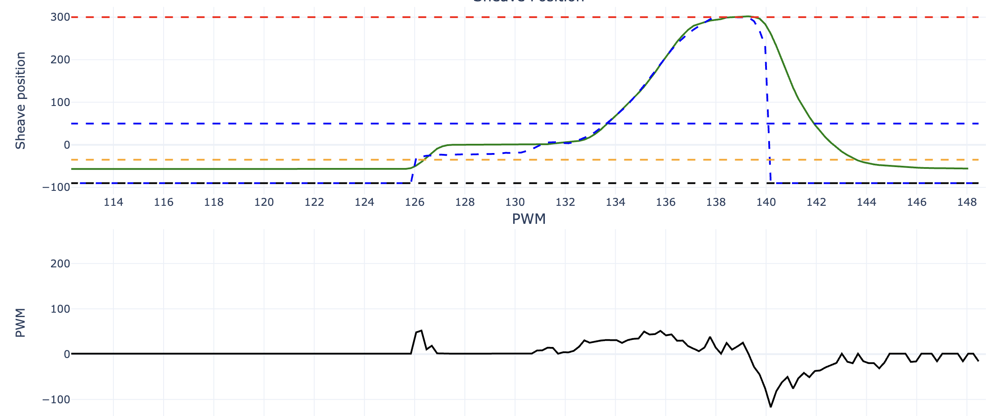

# Tuning and fixing motor driver issues 1/11



This plot was created while the car was on jackstands, so there is less load on the ecvt, but it does a good job of tracking the trajectory while the throttle is increased. However, in the begining and end, there is a small but significant negative error. This is because the current midgation to the motor driver changing direction issue is simply to not allow small negative resutlts:
```cpp
// to prevent changing motor direction unnecessarily
if ((result < 0.0) && (result > -15.0)) {
    result = 1;
}
```

This works well while the ecvt is engaged, but if we actaully do have a negative error, it will cause the ecvt to not move. This happens in the beginnign and end of the plot, where the sheave does not return all the way to the idle setpoint.
