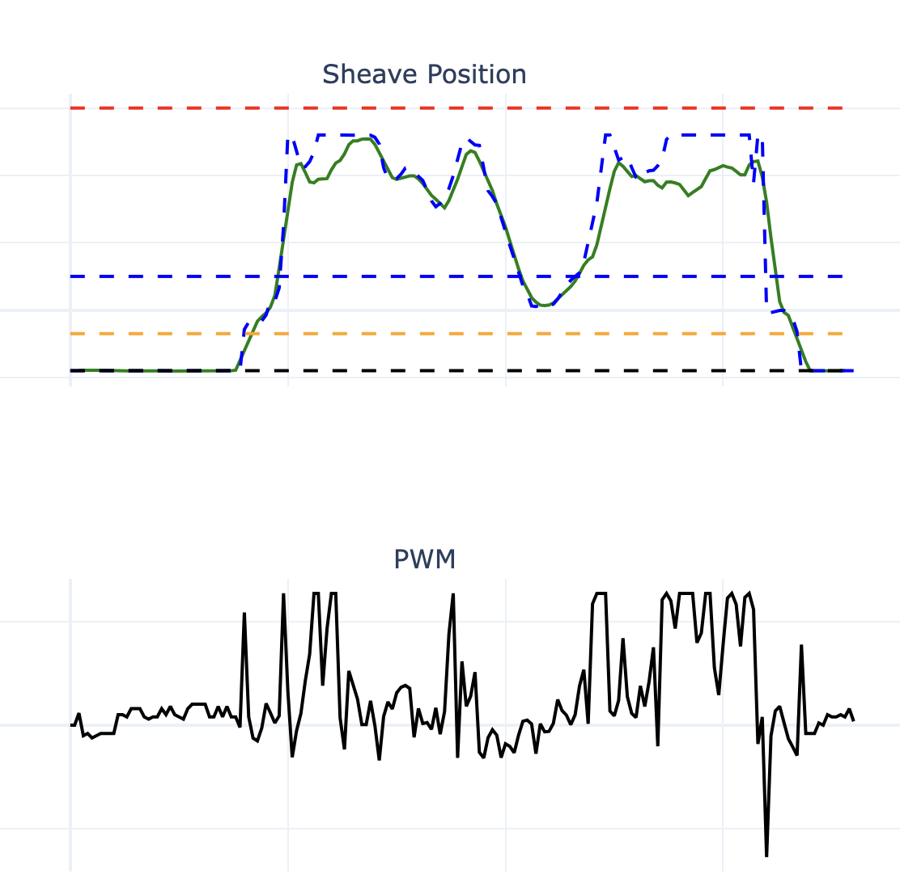

Data from a testing day on 10-26-2025

we were driving the car up and down the alley at full throttle trying to see how fast we could go. 
I think we can get a lot more speed out of the car by tuning better. 
Our max speed acording to the wheel speed and secondary speed sensors was ~25mph, I think we should be able to go at least 30.
Also, in some of the files the wheel speed sensor has very high readings, and in others it is correct, not sure why.



In the above image, we can see the sheave is not reaching the high setpoint a lot of the time. The PWM to the motor is not at its 
highest value of 255, so the motor has more power to give to reach the setpoint, but the motor control PID loop is not tuned properly. 
The PID loop is tuned well for when there is no external force on the motor, and preforms fine when there is a small force on the motor. 
It does not perform well when there is a high force on the motor, such as when trying to reach the highest setpoint. 

I tried to increase the P gain and decrease the D gain, which helped, but it was not enough, and it introduced big relativly low frequency oscliations 
when there was no force on the motor. I think I decreased D too much. 


```c++
#define POS_Kp 10 //4.3 
#define POS_Ki 0
#define POS_Kd 5  //80
```

New gains, comments were old gains. 

Note: we should be adding Ki to fix this issue, but in the past this has caused more issues than it solved so we have run 0 Ki.