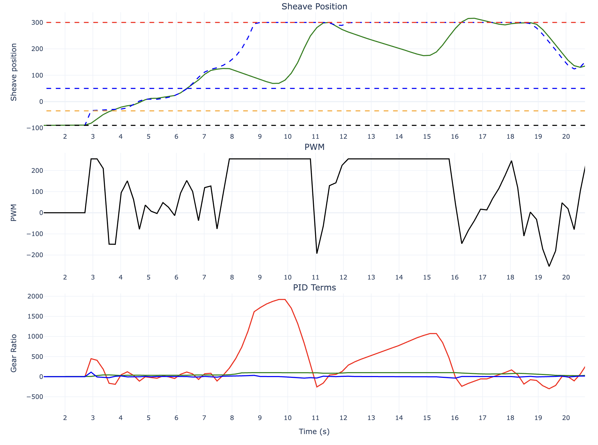
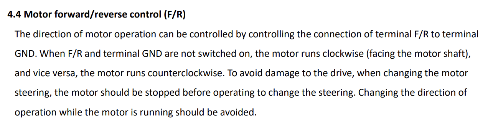
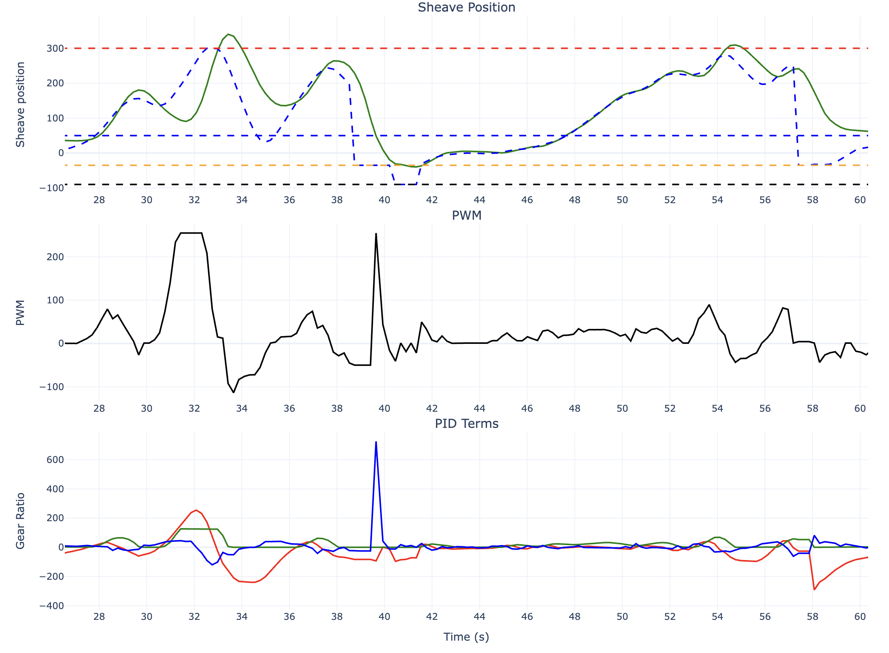

# Data from a testing day on 11-14-2025
 
## Summary

The aim if this tuning (continued from 11-6) was to add I gain to the PID controller, which previously had 0 I gain, to better enable the controller to track the setpoint, particularly at high setpoints where there is a large force on the sheave from the belt. 

We also discovered that a big reason for poor performance of the motor control loop was not due to poor choice of gains, but rather due to poor performace of the motor driver when switching directions. 

Additionaly, we felt that the issue from backwoods where not all the magnets were being detected by the hall sensor was no longer occuring, so we changed the code back to having 6 magnets, and that performed well. 

## Data Analysis

Look at the plot below. Up until ~7.5 seconds, the controller does a good job tracking the setpoint, but at 8 seconds, something goes wrong, and the sheave goes in the wrong direction for 2 seconds. This is quite bad, and happens very often, so we must prevent this from happening if we want to have good performance from the ECVT. 

So what is causing this? If we look at the PWM value during this time period, we see a it is at its max value of 255 for much of this time, but the sheave is still moving the wrong direction. The motor should have no problem matching the setpoint with less pwm, just look at 4-7 seconds, it is following the setpoint with much less PWM. 

If we look at the system just before error starts to grow, we see that the system has very little error, which is great, however, with this small error, the coresponding PWM output is very close to zero, and in fact is negative for a small amount of time at 7.5 seconds. Usually, this would not be a problem, but I believe that our motor driver is not designed to change direction rapidly, and this breif change in direction is causing us a lot of issues. This is a issue that we have observed many times, a small negative PWM causes the motor driver to breifly not control the motor effectivly (a large PWM does not spin the motor at much as we expect it to).

<!--  -->


In the manual for our motor driver, it states that you should avoid changing direction of the motor while while the motor is running, something we do very frequently




So how can we fix this. Today we implemented 2 software fixes, which imporved performance, but did not entirely fix the issue

One method was simply to discard small negative results. Any result (which becomes the PWM) between 0 and -15 will instead be 1. This improved performance while accelerating, but there were still times when the PWM would be past this threshhold. Increasing this threashold to far would be detrimental when we actualy need to move the sheave in the negative direction. 

```cpp
// to prevent changing motor direction unnecessarily
if ((result < 0.0) && (result > -15.0)) {
    result = 1;
}
```


Another solution was use a different Kp gain when the error is negative. As seen in the plots, the primary contributer to the negative PWM is the P gain when we have a negative error. If we use a smaller Kp when we have negative error, Ki will be able to dominate and keep the PWM to a small value. 

```cpp
if (error >=0 ) {
    result = error * POS_Kp + integral * POS_Ki + derivative * POS_Kd; // PI controller calculation
} else { //use different gains for negative error
    result = error * POS_Kp * Kp_multiplier + integral * POS_Ki + derivative * POS_Kd; // PI controller calculation
}
```

The ```Kp_multiplier``` will be set to a value less than one, say 0.5 so that the effective Kp is smaller on negative error. 

Additionaly, the Kp gain is reduced altegether, the gains we ended on were: 
```cpp
#define POS_Kp 1.5
#define POS_Ki 0.042
#define POS_Kd 30.0
#define POS_MAX_I_TERM 3000.0
#define Kp_multiplier 0.3 // use a lower Kp in the negative direction
```
Although they still likely need more tuning.


## Results

With these changes, the issue of a negative result messing with the motor driver were reduced, but not entirely eliminated. 

In the below plot, from 42 - 54 seconds. The controller does a great job tracking the setpoint, all with relativly small PWM, and the car acceleates well from 5mph to 28mph. However, in other part of the graph there are some setpoint overshoots which lead to negative error and therefore negative PWM. Ki may also be contributing to some of these overshoots, so decreasing that, or increasing Kd could help. 




## Next Steps


I do think we need to continue to address this issue if we want to get good performance out of Clank's ECVT. Some possible next steps:
* Continue to tune the threshold, Kp_multilpyer, other gain multiplyers, and gains in gerneral to reduce the likelyhood of this happening. 
* Implement some form of window of past results, and only allow result to change sign if it has been trying to for some number of past iterations.
* Buy a new motor driver that is designed to change direction 